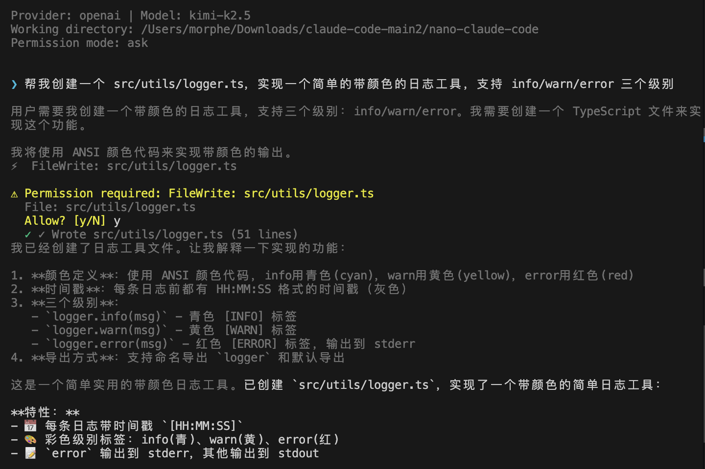

# nano-claude-code

[](LICENSE)

**A minimal AI coding agent in 1,646 lines of TypeScript.**

> Inspired by [Claude Code](https://docs.anthropic.com/en/docs/claude-code)'s 512K+ line codebase. Same core loop. 99.7% less code.

```
User Input → LLM → Tool Calls → Execute → Feed Results Back → Repeat
```



## Quick Start

```bash
git clone https://github.com/dadiaomengmeimei/nano-claude-code.git
cd nano-claude-code
npm install && npm run build
export ANTHROPIC_API_KEY=sk-ant-your-key-here
npm start
```

## 📚 Step-by-Step Tutorials

**Build an AI coding agent from scratch in 6 steps.** Each tutorial is a single runnable TypeScript file that builds on the previous one.

```bash
# Run any tutorial directly (no build needed):
ANTHROPIC_API_KEY=sk-xxx npx tsx tutorials/01-minimal-agent.ts "list all files"
```

| # | Tutorial | Lines | What You Build | What You Learn |
|---|----------|-------|----------------|----------------|
| [01](tutorials/01-minimal-agent.ts) | **Minimal Agent** | 80 | LLM + Bash in a loop | The core agent pattern: `while(tool_calls) { execute → feed_back }` |
| [02](tutorials/02-file-tools-streaming.ts) | **File Tools + Streaming** | 150 | + FileRead, FileWrite, streaming | Multiple tools, real-time token output |
| [03](tutorials/03-permissions.ts) | **Permissions** | 160 | + Y/N confirmation for writes | Read=auto, write=ask — the simplest safety model |
| [04](tutorials/04-context-awareness.ts) | **Context Awareness** | 170 | + CLAUDE.md, project detection, Git | Why Claude Code's prompt is "assembled, not written" |
| [05](tutorials/05-repl-conversation.ts) | **REPL + Memory** | 170 | + Interactive loop, /commands | Conversation state, slash commands |
| [06](tutorials/06-search-and-edit.ts) | **Full Agent** | 210 | + Grep, Glob, FileEdit | Complete 6-tool agent in one file |

**Tutorial 06 is essentially nano-claude-code in a single file.** The full `src/` version adds: modular architecture, Zod schemas, OpenAI-compatible provider, config system, and pipe mode.

> 💡 Each file is self-contained. Start from 01 and work your way up, or jump to any step.

## vs Claude Code

| | Claude Code | nano-claude-code |
|---|---|---|
| Source files | ~1,900 | **15** |
| Lines of code | 512,000+ | **1,646** |
| Runtime deps | 50+ | **4** |
| Tools | 40+ | **6** |
| Runtime | Bun | **Node.js ≥ 20** |

## Features

- 🔄 **Agent Loop** — Query → tool-use → result → reasoning cycle (up to 30 rounds)
- 🌊 **Streaming** — Real-time token-by-token output
- 🛠️ **6 Tools** — Bash, FileRead, FileEdit, FileWrite, Grep, Glob
- 🔐 **Permissions** — Read-only auto-allowed; write/shell requires confirmation
- 📋 **Context Aware** — Auto-reads `CLAUDE.md`, detects project type, gathers Git info
- 💬 **REPL** — Slash commands (`/help`, `/clear`, `/history`, `/exit`)
- 📡 **Pipe Mode** — `echo "fix the bug" | nano-claude` for scripting
- 🔌 **Extensible** — `LLMProvider` interface for OpenAI/Ollama/local models

## Architecture

```
nano-claude-code/
├── tutorials/             # 👈 Start here! 6 progressive tutorials
│   ├── 01-minimal-agent.ts
│   ├── 02-file-tools-streaming.ts
│   ├── 03-permissions.ts
│   ├── 04-context-awareness.ts
│   ├── 05-repl-conversation.ts
│   └── 06-search-and-edit.ts
└── src/                   # Full modular implementation
    ├── main.ts            # Terminal REPL + permission UI
    ├── agentLoop.ts       # Core: LLM → tool detection → execution → loop
    ├── types.ts           # Message, Tool, Provider, Config types
    ├── prompt.ts          # System prompt builder
    ├── context.ts         # CLAUDE.md + project detection + Git
    ├── api/anthropic.ts   # Anthropic streaming provider
    ├── api/openai.ts      # OpenAI-compatible provider (Kimi, DeepSeek, etc.)
    ├── tools/             # 6 tools: bash, fileRead, fileEdit, fileWrite, grep, glob
    └── utils/             # Config loading, Zod → JSON Schema
```

## Configuration

Via environment variables or `~/.nano-claude.json`:

| Variable | Default | Description |
|---|---|---|
| `ANTHROPIC_API_KEY` | — | Your API key |
| `NANO_MODEL` | `claude-sonnet-4-20250514` | Model |
| `NANO_MAX_TOKENS` | `16384` | Max tokens per response |
| `NANO_PERMISSION_MODE` | `ask` | `ask` or `auto` |

## Extending

**Add a tool** — implement `ToolDefinition`, register in `src/tools/index.ts`:

```typescript
export const MyTool: ToolDefinition = {
  name: "MyTool",
  description: "Does something useful",
  inputSchema: z.object({ query: z.string() }),
  async call(rawInput, context) {
    const input = this.inputSchema.parse(rawInput);
    return { output: `Result: ${input.query}` };
  },
  formatResult: (r) => r.output,
};
```

**Add a provider** — implement `LLMProvider` interface. See `src/api/anthropic.ts`.

## Sister Project

📖 **[Claude Code Sourcemap Learning Notebook](https://github.com/dadiaomengmeimei/claude-code-sourcemap-learning-notebook)** — Deep architectural analysis of the full Claude Code codebase. 8 chapters, 11 transferable design patterns, ~5.5 hours of content.

**Read the notebook to understand *why*. Run nano-claude-code to understand *how*.**

## License

MIT
